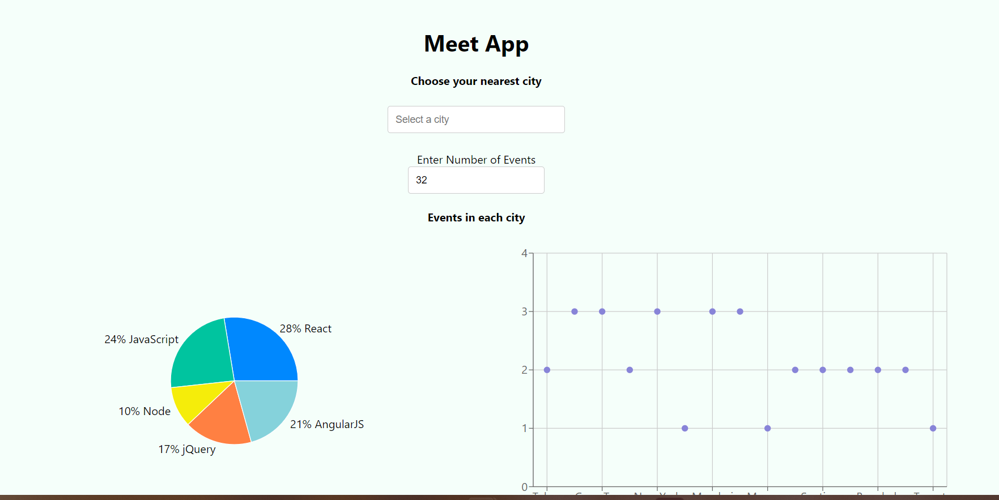

# Meet App
The aim of this project is to build a serverless, progressive web application (PWA) with React using a test-driven development (TDD) technique. The application uses the Google Calendar API to fetch upcoming events.

## Built and Tested with:
- Amazon Web Services (AWS)
- Google Cloud Platform
- JavaScript
- React
- Puppeteer
- Jest
- Enzyme
- Recharts

## Key Features:
1.	Filter events by city.
2.	Show/hide event details.
3.	Specify number of events.
4.	Use the app when offline.
5.	Add an app shortcut to the home screen.
6.	View a chart showing the number of upcoming events by city.

### FEATURE 1: Filter events by city
**User stories:** - As a user, I should be able to filter events by city so that I can see the list of events that take place in that city.

**Scenario 1:** By default, when user hasn’t searched for a city, show upcoming events from all cities. 
```
Given user hasn’t searched for any city
When the user opens the app
Then the user should see the list of upcoming events
```
**Scenario 2:** The user should see a list of suggestions when they search for a city. 
```
Given the main page is open
When user starts typing in the city textbox
Then the user should receive a list of cities (suggestions) that match what they’ve typed
```
**Scenario 3:** The user can select a city from the suggested list. 
```
Given the user was typing “Berlin” in the city textbox, and the list of suggested cities is showing
When the user selects a city (e.g., “Berlin, Germany”) from the list
Then their city should be changed to that city (i.e., “Berlin, Germany”).
  And the list of suggestions should disappear.
  And the user should receive a list of upcoming events in that city
```

### FEATURE 2: Show/Hide an event’s details
**User stories:** -	As a user, I would like to be able to show/hide event details so that I can see more/less information about an event.

**Scenario 1:** An event element is collapsed by default.
```
Given the list of events has been loaded
When user sees events and hasn’t clicked on any event
Then the user should see event elements collapsed by default
```

**Scenario 2:** User can expand an event to see its details.
```
Given the list of events has been loaded
When user clicks on “Show details” button for an event
Then the event element will be expanded to show the event details
```

**Scenario 3:** User can collapse an event to hide its details.
```
Given the app is loaded
And the event element is expanded to show event details
When user clicks on “Hide details” button for that event
Then the event element will be collapse and hide the event details
```

### FEATURE 3: Specify number of events
**User stories:** - As a user, I would like to be able to specify the number of events I want to view in the app so that I can see more or fewer events in the events list at once.

**Scenario 1:** When user hasn’t specified a number, 32 is the default number.
```
Given the list of events has been loaded
When user hasn’t specified a number in the “Number of events” textbox
Then user should see number 32 in the “Number of events” textbox
```

**Scenario 2:** User can change the number of events they want to see.
```
Given the list of events has been loaded
When user enters a number in the “Number of events” textbox
Then the number entered in the “Number of events” textbox should reflect the number of events the user sees 
```

### FEATURE 4: Use the app when offline
**User stories:** - As a user, I would like to be able to use the app when offline so that I can see the events I viewed the last time I was online.

**Scenario 1:** Show cached data when there’s no internet connection.
```
Given the user opened the app online and searched for events
When user goes offline
Then user should see cached data of their previous activity when there’s no internet connection.
```

**Scenario 2:** Show error when user changes the settings (city, time range).
```
Given the user used the app while online and is now offline
When user changes the settings (city, time range).
Then user should see an error message
```

### FEATURE 5: Add an app shortcut to the home screen
**User stories:** - As a user, I would like to be able to add the app shortcut to my home screen so that I can open the app faster.

#### Scenario: No scenario is need for this feature. Feature handled by user’s OS.

### FEATURE 6: Data visualization
**User stories:** - As a user, I would like to be able to see a chart showing the upcoming events in each city so that I know what events are organized in which city.

**Scenario 1:** Show a chart with the number of upcoming events in each city.
```
Given the user selected a city
When user clicks on the city’s upcoming events
Then user should see a chart showing upcoming events in that city
```
## Contact:
Please feel free to contact me and offer any type of advice. As I begin my journey through web develeopment, I am always open to advice and helpful ways to accomplish whatever task given to me. Please feel free to reach out to me!
- Jude Dongmo - donkeju.dj@gmail.com
- GitHub -  https://github.com/Dj2035
